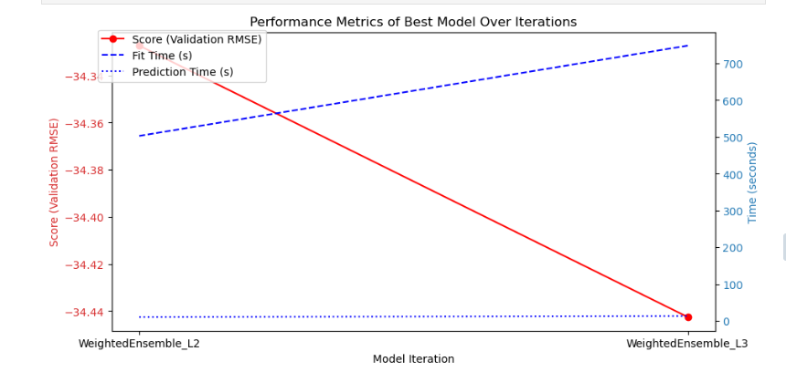
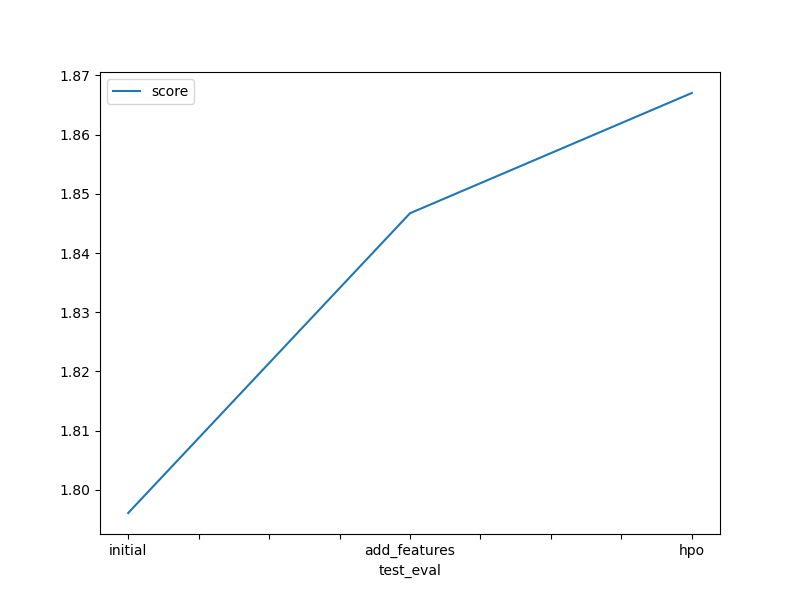

# Report: Predict Bike Sharing Demand with AutoGluon Solution
#### NAME HERE

## Initial Training
### What did you realize when you tried to submit your predictions? What changes were needed to the output of the predictor to submit your results?
All the predicted outputs had to be non zero.

### What was the top ranked model that performed?
The top ranked model was the last model the one I tuned with the hyperparameters

## Exploratory data analysis and feature creation
### What did the exploratory analysis find and how did you add additional features?
During the exploratory data analysis (EDA) phase, I discovered that two features present in the training set were missing from the test set. Additionally, I observed that the 'date' feature was a composite of year, month, day, and hour. To make this information more accessible for modeling, I separated these components into individual features. Furthermore, I introduced a new feature called 'is_peak_hour' to identify peak hours, hypothesizing that these times would likely see increased demand.

I also found that various factors such as weather conditions, time of day, and holidays significantly influence bike rental patterns. These insights helped guide the subsequent phases of my analysis and modeling.

### How much better did your model preform after adding additional features and why do you think that is?
it went from -50.847083 rmse score to  - 84.125061 rmse score range , it's supposed to improve because the models have more features to learn from, and that allowed the model to better capture decision patterns in the data.

## Hyper parameter tuning
### How much better did your model preform after trying different hyper parameters?
looking at the results it seems that it didn't improve which is shoking for me 

### If you were given more time with this dataset, where do you think you would spend more time?
exploring in details the trends and figure our which features corrolate and which doesn't do only keep relevant features and then try forecasting it will probably yield better results

### Create a table with the models you ran, the hyperparameters modified, and the kaggle score.
|model|time|hyperparams search process|score|
|--|--|--|--|
|initial|600|default|1.83850|
|add_features|600|default|1.84672|
|hpo|800|tuned|1.86704|

### Create a line plot showing the top model score for the three (or more) training runs during the project.

### Create a line plot showing the top kaggle score for the three (or more) prediction submissions during the project.

## Summary
In this project, I aimed to predict bike sharing demand using AutoGluon. Through exploratory data analysis, I found that factors like weather conditions, time of day, and holidays significantly affect bike rental patterns. 
Going forward, I plan to refine my feature engineering techniques and explore more advanced modeling approaches to improve accuracy. The project offered valuable insights but also highlighted areas for further development to enhance the predictive performance.
